# COVID Early Warning System Project Overview

This project is an attempt to define a good early warning indicator for COVID outbreaks. States and public health agencies have a difficult job to keep COVID transmission under control. They could benefit from a system that provides them an early and accurate warning of an increase in new COVIC infections in their jurisdiction. 

This project grew out of an interest to compare the available data from states that had experienced an outbreak vs. states that hadn't experienced an outbreak. As the analysis progressed it became clear that the common statistical measures of COVID-19 infection spread that are utilized today--total cases, case rates, and positive test rates--are not all equally informative. One is better than the others, yet all of them have their shortcomings. Part of the project explores the shortcomings with the measures that are currently available. 

Taken together, this analysis helped to inform the idea of an alternative regional COVID-19 early warning system that addresses some of the shortcomings of the currently available tools and could provide an early and accurate warning of an increase in new COVID infections, which could ultimately allow state governments and public health agencies to react sooner and keep an uptick from turning into an outbreak. This system is described in more detail [here](https://github.com/salvir1/covid-early-warning-system). 

## Goals

The high level goals of this project are:
- To characterize the difference at the regional level between an uptick and an outbreak in COVID case rates
- To develop statistics that could become the foundation of a COVID-19 earling warning system (described [here](https://github.com/salvir1/covid-early-warning-system))
- To work with various EDA and data visualization tools and techniques

## Tools and techniques used in this project

**Tools**
- Python, Jupyter Lab, SciKitLearn, Pandas, Numpy

**Visualization**
- Plotly, Matplotlib

**Techniques**
- Spatial mapping, simple moving average, simulation

## Raw data sourced from COVID Tracking Project

- Terms of use: The COVID Tracking Project at The Atlantic’s data and website content is published under a Creative Commons CC BY 4.0 license, which requires users to attribute the source and license type (CC BY 4.0) when sharing our data or website content.
- Citation: [the COVID Tracking Project](https://www.covidtrackingproject.com), Creative Commons CC BY 4.0 license

## State groupings bring important trends to light

As the COVID-19 epidemic unfolded in the US over the course of 2020, outbreaks came in waves. These waves were not uniform across the country. Rather, each of the three distinct identifiable waves had its own unique geographic distribution. Most states, thankfully, only experienced one wave. Many others avoided severe outbreaks altogether. For those that had an outbreak, they were costly in terms of lives lost. By grouping states together according to outbreak--and a fourth group of states that did not experience an outbreak--one can see these outbreaks clearly, and also see just how costly these outbreaks were. ([Click here to learn how these groups were constructed](####state-groupings)).

The four charts below illustrate the outbreaks in different ways. The upper left chart shows daily deaths per 100,000 people for the four different groupings. The upper right chart shows daily new case diagnoses per 100,000 for the same groupings. The lower left chart shows the total new diagnoses made per day. Finally, the lower right chart shows the positive test rate per day. A discussion of these charts and related topics follow. [Click here](####large) for larger versions of these charts.

 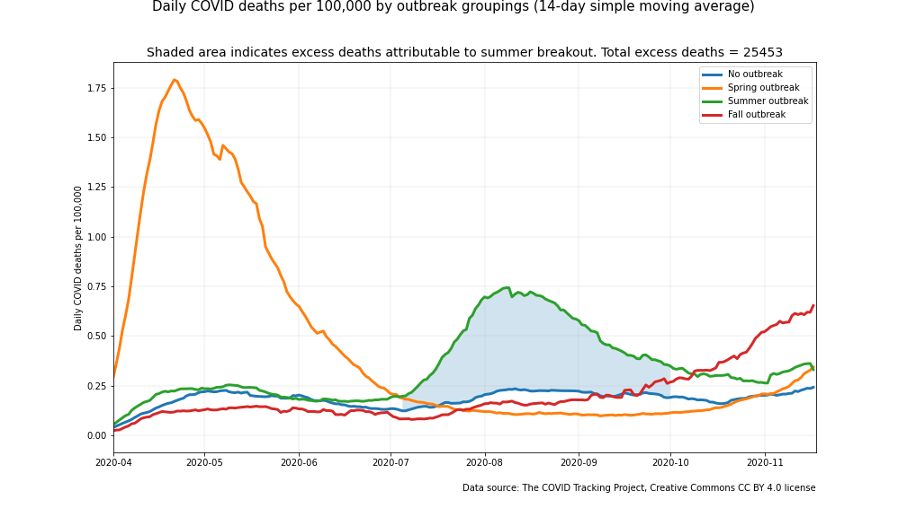
 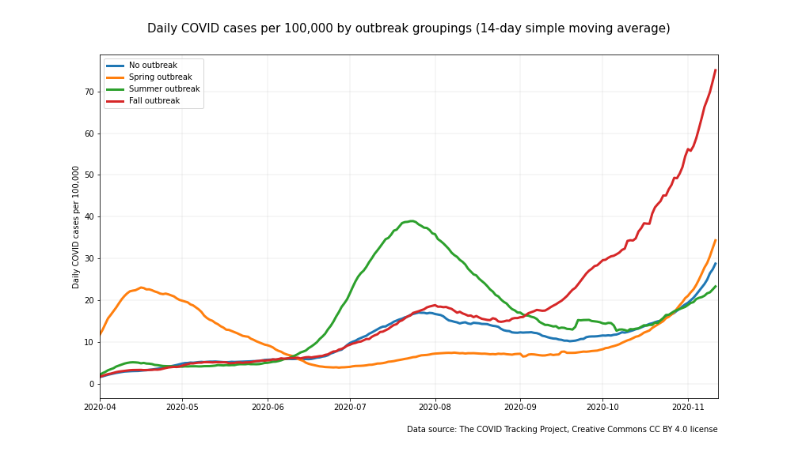

 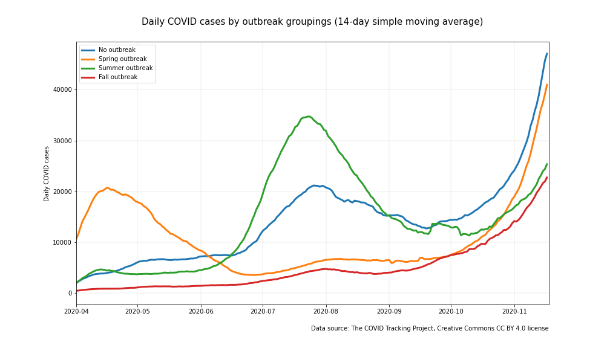
 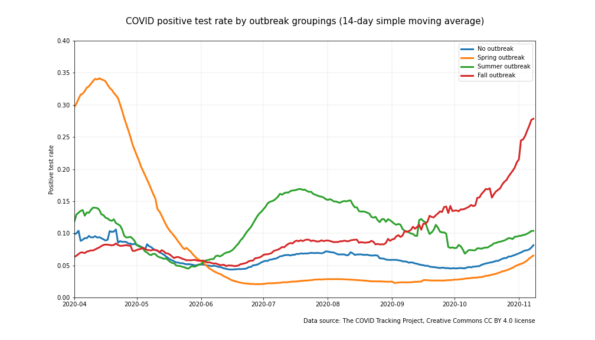

### Outbreak avoidance saves lives

The chart of death rates shows that states with outbreaks experienced death rates that were many times worse than states with no outbreak over the same time period. The baseline daily death rate stayed below 0.25 per 100,000 if no outbreak was occurring. Death rates were three or more times higher for groupings that were experiencing an outbreak. The cost of an outbreak in terms of lives lost can be extrapolated by comparing the elevated death rate of an outbreak to baseline. For example, the states that experienced a summer outbreak had over 25,000 more deaths above baseline.

### Time is critical to contain an emerging outbreak

The chart of case rates shows a shared baseline among groups that weren't experiencing an outbreak. (The baseline rose a bit over the summer. Much of it might be attributable to the vastly expanded testing availability that occurred during that period and allowed for more cases to be diagnosed. Note that there was little change in death rate over the summer for the groups that didn't experience an outbreak). The successive outbreaks emerged quickly and rose steeply. The implicit message in the sharpness of the outbreak curves is that time is critical to contain an emerging outbreak.

The curve becomes even more steep if we look at total infections, and not just those that were confirmed with a diagnosis. One recent study estimated as many as 3 to 20 more people may have been infected than those who were diagnosed ([Wu](https://www.nature.com/articles/s41467-020-18272-4)). Some people infected with COVID are asymptomatic and do not know to get tested. A recent meta-analysis found that 17% of COVID-19 cases are asymptomatic ([Byambasuren](https://jammi.utpjournals.press/doi/abs/10.3138/jammi-2020-0030). Others may develop symptoms but may not get tested. And there's false negatives from testing. We can use a conservative estimate of 2.5 infections for every diagnosis to get a picture of just how steep the actual infections curve looks (2.5x as steep to be precise). Here's an illustration for two states that experienced recent outbreaks.

 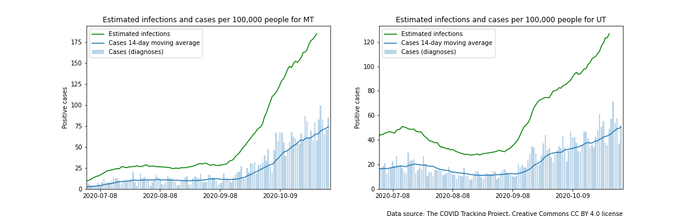

### Time is critical: Old news is not good news

The vast majority of the positive case data that states are using comes from people who are symptomatic. This is problematic. People who become infected with COVID generally won't know to be tested (unless contact tracing is in place and working well) until they develop symptoms which is commonly thought to be 4-5 days after exposure on average. They then need to decide to get tested, get tested (probably depends on the severity of the infection--it could range from 1 day to never), and await for the test results find their way to the tracking system (which can be from 1 to several days). Simply adding up these numbers suggests that relying on data from symptomatic people can easily add a delay of 8 days or more from infection. The infection estimates in the previous time series were shifted back 8 days to simulate when the infections occurred. 

Is there a test regimen and test process system that could shorten this delay from exposure? Perhaps. Further discussion of this can be found [here](https://github.com/salvir1/covid-early-warning-system).

### Time is critical: Noisy data adds delay

COVID testing regimens have been designed for other reasons than to provide a statistically accurate measure of the changing rate of infection in a population. As such, noise finds its way into the signal. For instance, the COVID test sites in a jurisdiction often test for different reasons. Clinics may be doing pre-procedural testing to confirm the absence of COVID pre-procedure. Positive test rates from these sites will mirror disease prevalence among asymptomatic people, which is probably less than 1-2%. These clinics may perform these tests only a few days a week. Locations run by public health agencies may be testing mostly symptomatic people some days. Positive test rates from these sites on these days may exceed 25% or more. At different days for these same public health agency locations, they may test a high percentage of asymptomatic students from a school or employees from a company, thus reducing the positive test rate significantly.

States report all submitted test reports in a single batch for a day. A test site's contribution to the total can fluctuate significantly from day-to-day. Consequently, the ratio of symptomatic to asymptomatic people in a batched daily test report for a state can--and does--vary tremendously. 
Another layer of noise is introduced when test samples are processed at the labs and reported back. Test sites across a state may utilize different labs. Turnaround times for the various labs are often different. Some labs may batch tests and report several days worth of results at a time, where others report every 24 hours. Not only could this lack of process affect the ratio of symptomatic to asymptomatic people in a batched daily test report, it can have a big impact on the total number of tests reported on in any given day. Taken together, the fluctuating ratios of symptomatic to asymptomatic people in the test pool and the different batching methods contribute to noisiness in the signal from day-to-day. This shows up in COVID monitoring metrics such as positive test rate and case rate time. Look at the high daily variability in the data in the two charts below for the state of Montana (which is not out of the ordinary). Positive test rate is more variable, but both are high.

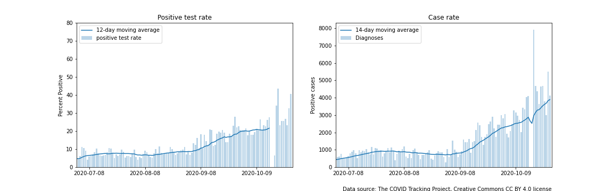</img>

### A closer look at timing

Governments and public health agencies are unlikely to drive the death rate down to zero until a vaccine is available, but they can work to avoid an outbreak and the associated costs of lives lost. Clearly, timing is important. By the time death rates start to increase, an outbreak has been many weeks in the making. While the death rate may be the most direct measure of the cost of the pandemic, it's a lagging indicator. Governments and public health agencies need an early warning system--a leading indicator or indicators--in order to have the best chance at keeping the rate of infections, and thus deaths, under control in their jurisdictions. 

The two sources of delay referenced above hinder the ability of the COVID monitoring systems to detect an outbreak in a timely fashion. Returning to the positive test rate and case rate charts for Montana, estimates of warning trigger events have now been added. Both the left and right charts now have a horizontal line 'control limit' line drawn in. This line is two standard deviations above the mean for the month of August for the positive test rate time series and the case rate time series. The two vertical lines indicate when the moving averages of the time series crossed the control limits--i.e. when their signals might have triggered a warning. The simulated warnings occur well after the infection rates have begun to rise.

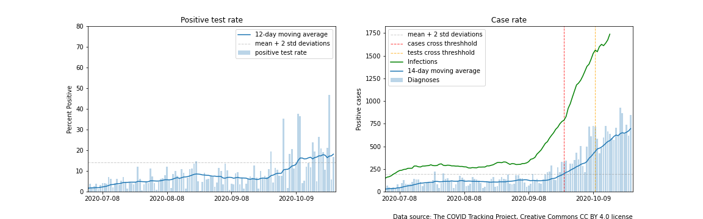</img>

### Normalization of the data improves it

Returning to the original four charts, one small but important detail to note is that normalizing data can make for better comparisons. The chart of *total cases diagnosed per day* isn't as clean of an indicator of an outbreak. In this graph, the trendline of total cases diagnosed in the *no outbreak* group rose almost as much as the trendline for the *summer outbreak* group. All trendlines rose heading into the fall even though the outbreak for the *fall outbreak* group has thus far been more severe. The normalization that occurs in the *case rate* chart more accurately sorts  out the true signal. 

### We learned from the traumatic events of the spring how to reduce adverse outcomes

It's informative to compare the peaks in the trendlines between the *death rate* and the *case rate* charts. As one would expect, the peaks of the case rate trendlines happen earlier than the peaks of the death rate trendlines. What is less expected is the differences in their relative sizes. Fortunately, the peak of the summer outbreak death rate was less than half the size as that of the spring outbreak. The corresponding case rate peak was almost twice as large for the summer outbreak as it was for the spring outbreak. A likely explanation for some of the difference in death rates is that the medical community learned how to take better care of COVID patients over time. It's also likely that people who were most at risk to adverse outcomes from COVID were infected at lower rates in those places that experienced a summer outbreak than they were in locations that experienced a spring outbreak. It could be that we learned how to take better care of COVID patients and also improved our ability to keep the most vulnerable of us from getting infected with COVID in the first place.

### Should we be looking more keenly at infection rates of COVID in people with high contact rates?

It's also informative to compare the height of the peaks of the death rate and case rate for the summer outbreak (and also for the fall outbreak although that story has not yet fully played out). The change in testing availability muddies things up a bit, but visually it appears as if the change in height of the case rate surpasses the change in height of the death rate. In other words, infection rates may have expanded more than death rates. This is plausible when one considers that neither transmission rates nor risk of adverse outcomes are uniform across a population. Taking the transmission rates first, transmission occurs through proximite human-to-human contact. One would expect people with higher contact rates to have higher rates of infection. *Indeed, one would expect the spread of COVID virus to be dependent upon those of us with higher contact rates.* Now, taking adverse outcomes into account, certain subsets of the population have much higher risk of death than others. Seventy-nine percent of COVID deaths in the US occurred in [people older than 65](https://www.cdc.gov/nchs/nvss/vsrr/covid_weekly/index.htm). Continued emphasis must be on reducing transmission to this population. This knowledge could be used as the foundation for a targeted COVID surveillance system. We could monitor COVID infection rates among the most mobile of us where an outbreak will start to form first as one key element in a strategy to minimize transmission to the most vulnerable of us.

#### Large

</img>

</img>

</img>

</img>

#### State groupings

How were these groupings made? For this analysis, states were grouped into one of four categories based upon season and severity of an outbreak in terms of daily deaths reported per 100,000. An outbreak was defined at the state level according to criteria desribed in the states analysis section. When rolled up to the state grouping level, the daily death rate exceeded 0.25 per 100,000 population for an outbreak. Outbreaks for the spring, summer, and fall began prior to 4/1/20, 7/1/20, and 10/1/20 respectively.

Spring outbreak
- Occurred primarily in the northeast, Great Lakes region, and Louisiana
- Exceeded 0.8 deaths per 100,000 per day between June and August
- About 90M people are in this group

Summer outbreak
- Occurred primarily in the southeast and Arizona
- Exceeded 40 cases per 100,000 per day or 0.5 deaths per 100,000 per day between June and August
- About 89M people are in this group

Fall outbreak
- Upper midwest and Arkansas at this time with more states to be added if they meet the threshholds
- Exceeded 40 cases per 100,000 per day or 0.5 deaths per 100,000 per day after August
- About 16M people are in this group

No outbreak
- Avoided classification in one of the other outbreak categories
- About 133M people are in this group

### Comparing trends at the state level

The state groupings help to sort the state trends in a meaningful way. One good way to see this is to look at the death rate trendline at the state level for just 25 states. The chart below of daily COVID death rates by state over time is a confusion of squiggly lines, although one can start to see patterns if one looks long enough. 

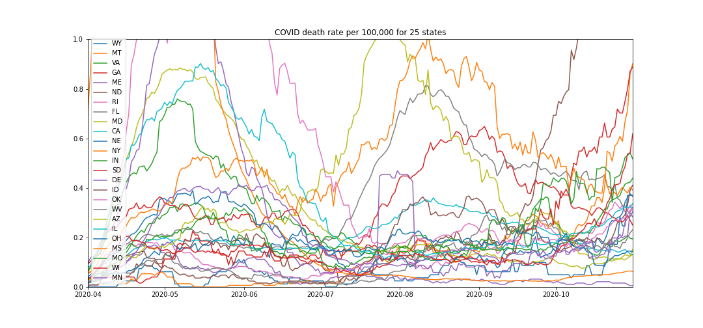</img>

The state level trendlines become more understandable when states are presented in the same groupings as before. The following charts display the same COVID statistics as above (except for total cases which isn't that helpful of a metric), but now at the state level.

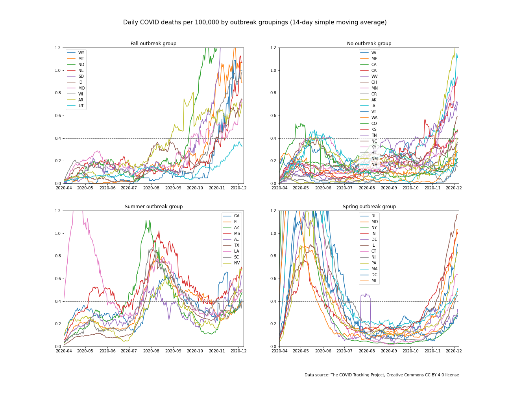</img>

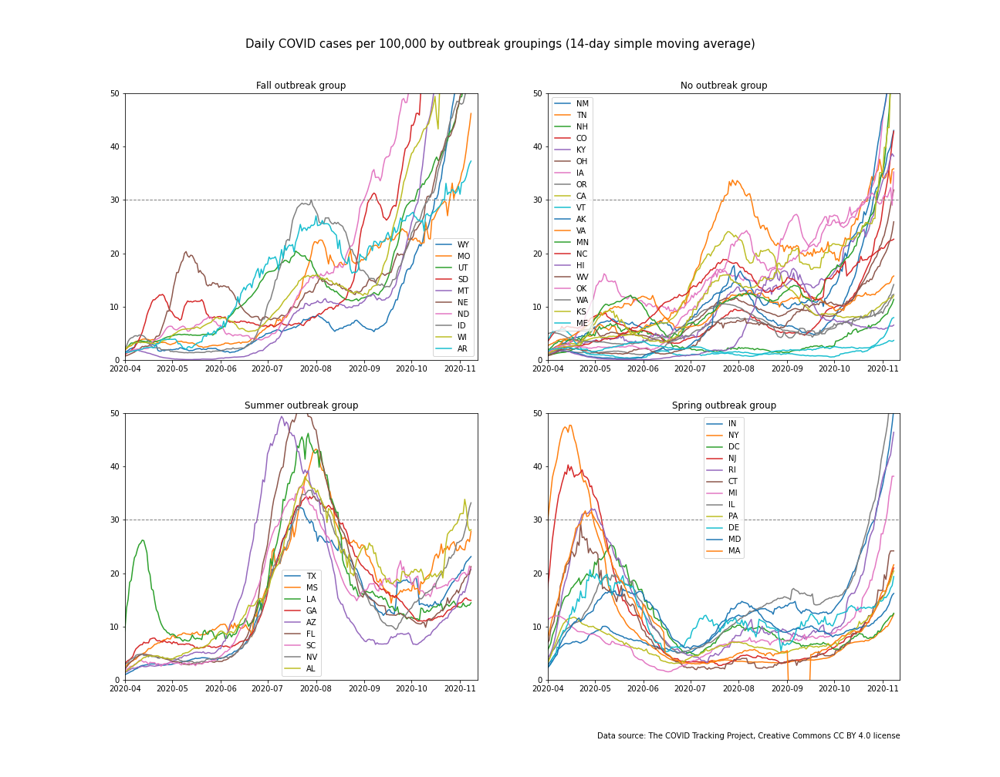</img>

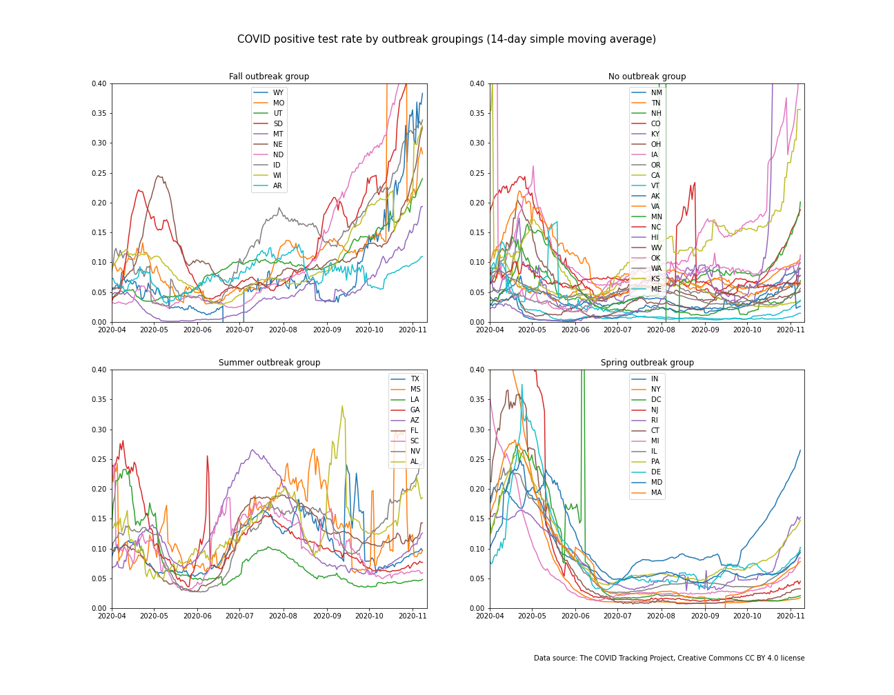</img>

While the groupings help to make sense of the state level data, there's one obvious problem with most of the trendlines no matter which grouping they fall into. They're all very noisy. If one is looking at these signals to determine if there's been an underlying and important shift in the rate of new COVID infections, the variability is going to cloud that decision and cause delay. This will be discussed more in the next section.

Another way to display changes over time at the state level is with an animation. Animations were constructed to demonstrate the dynamic ebb and flow of COVID-19 over time by state. These three animations show the geographic progression of the outbreaks over time. (Due to the limitations of the Github repo to run html in markdown language, you may need to copy the html files to a local folder and then open them to see the animation. Links to the files are here. They can be found in the img directory of this repo.)

[death rate animation](https://github.com/salvir1/outbreak-vs-uptick/blob/main/img/death-rate-map.html)

[case rate animation](https://github.com/salvir1/outbreak-vs-uptick/blob/main/img/case-rate-map.html)

[positive test rate animation](https://github.com/salvir1/outbreak-vs-uptick/blob/main/img/positive-rate-map.html)

### SIDEBAR: Case fatality ratio

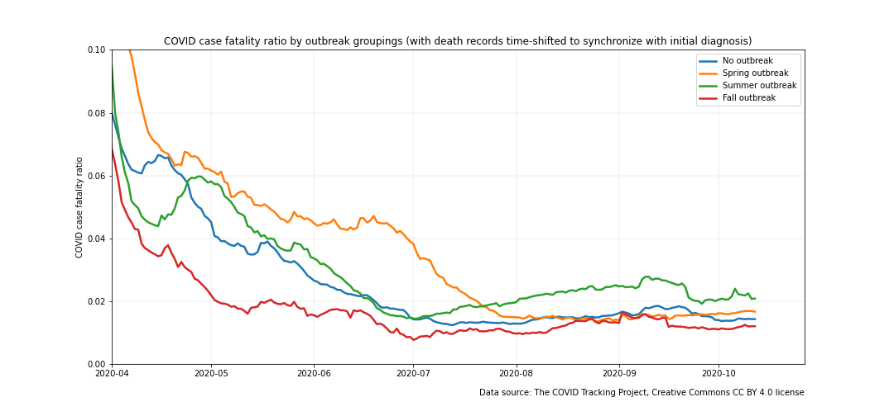</img>

Note that the reported death time series was shifted forward by 14 days to synchronize up better with the case time series so that an accurate case fatality ratio could be calculated.
What are the takeaways from this chart?

- The case fatality ratio has been reduced significantly from the early days of the pandemic. This can probably be attributed to several factors. For one, much more testing is being done, so fewer cases are being missed. For two, the medical community knows much more about how to care for patients with the disease, which has probably led to better outcomes. 
- The case fatality ratio crept up a bit for the summer outbreak group, but otherwise hasn't seen marked changes after spring ended. There's no strong indication that summer's crowded hospitals had a major impact on case fatality--at least in this slice of the data.

## Areas for further study

- This analysis informed the development and simulation of an early warning system based on randomized sampling of a subset of a population of people for pre-symptomatic COVID infection. This proposed early warning system is described in more detail [here](https://github.com/salvir1/covid-early-warning-system). 
- Another further area of study would be to extend this analysis to other geographic regions outside of the US such as Europe.

## Contributors
[Rob Salvino](https://github.com/salvir1)

## License
[MIT ©](https://choosealicense.com/licenses/mit/)
