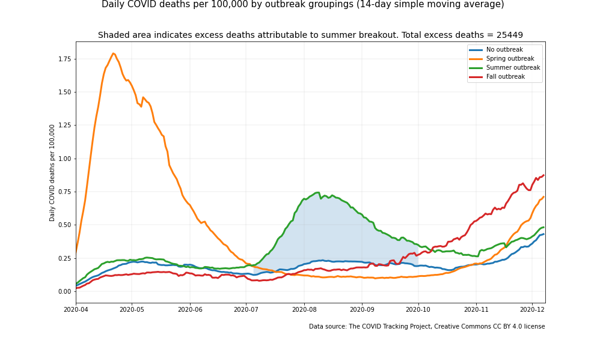
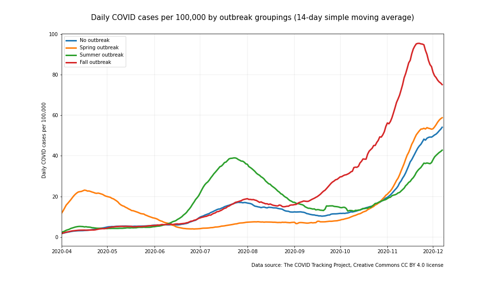
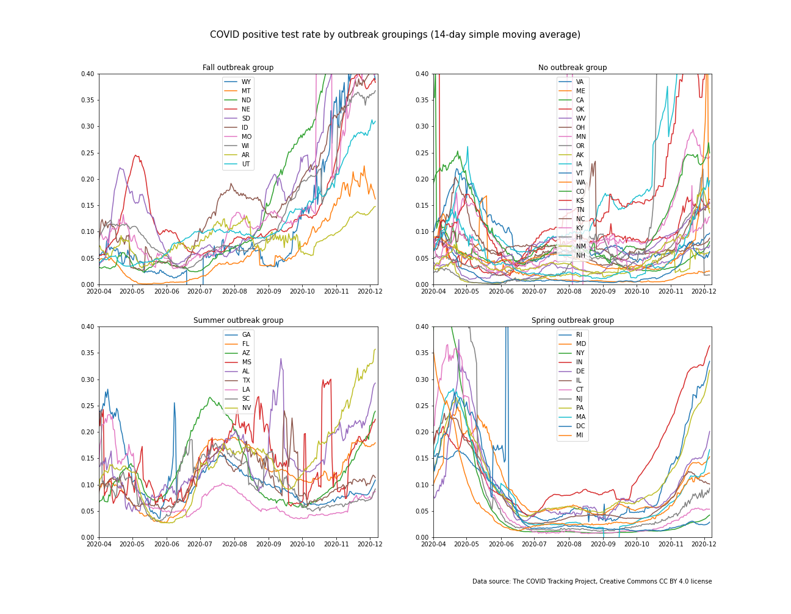
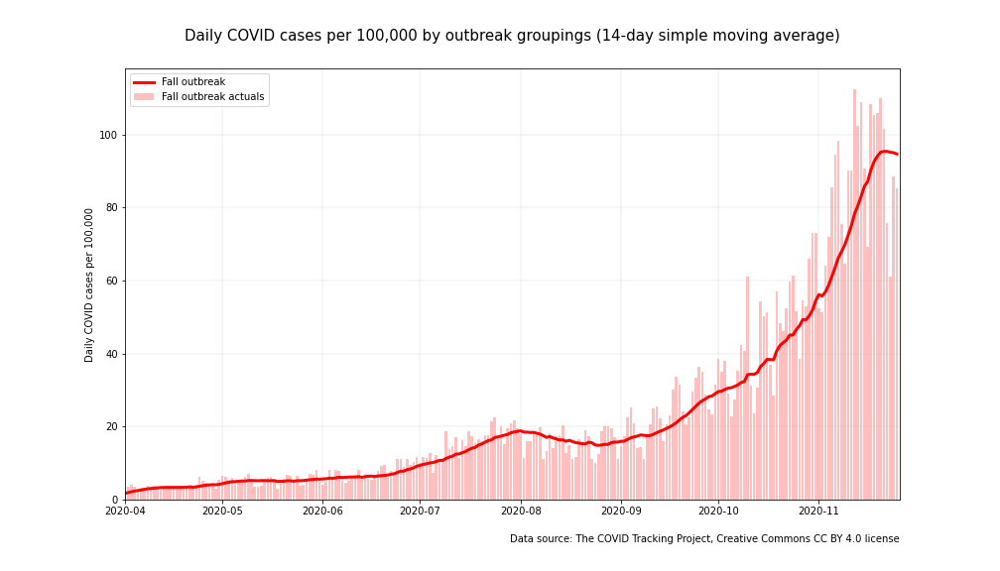

# COVID Early Warning System Project Overview

This project is an attempt to define a good early warning indicator for COVID outbreaks. States and public health agencies have a difficult job to keep COVID transmission under control. They could benefit from a system that provides them an early and accurate warning of an increase in new COVIC infections in their jurisdiction that has a strong probability of becoming an outbreak. 

This project grew out of an interest to compare the available data from states that had experienced an outbreak vs. states that hadn't experienced an outbreak. As the analysis progressed it became clear that the common statistical measures of COVID-19 infection spread that are utilized today--total cases, case rates, and positive test rates--are not all equally informative. One is better than the others, yet all of them have their shortcomings. Part of the project explores the shortcomings with the measures that are currently available. 

Taken together, this analysis helped to inform the idea of an alternative regional COVID-19 early warning system that addresses some of the shortcomings of the currently available tools and could provide an early and accurate warning of an increase in new COVID infections, which could ultimately allow state governments and public health agencies to react sooner and keep an uptick from turning into an outbreak. This system is described in more detail [here](https://github.com/salvir1/covid-early-warning-system). 

## Goals

The high level goals of this project are:
- To characterize the difference at the regional level between an uptick and an outbreak in COVID case rates
- To develop statistics that could become the foundation of a COVID-19 earling warning system (described [here](https://github.com/salvir1/covid-early-warning-system))
- To work with various EDA and data visualization tools and techniques

## Tools and techniques used in this project

**Tools**
- Python, Jupyter Lab, SciKitLearn, Pandas, Numpy

**Visualization**
- Plotly, Matplotlib

**Techniques**
- Spatial mapping, simple moving average, simulation

## Raw data sourced from COVID Tracking Project

- Terms of use: The COVID Tracking Project at The Atlantic’s data and website content is published under a Creative Commons CC BY 4.0 license, which requires users to attribute the source and license type (CC BY 4.0) when sharing our data or website content.
- Citation: [the COVID Tracking Project](https://www.covidtrackingproject.com), Creative Commons CC BY 4.0 license

### A meaningful grouping of outbreaks

As the COVID-19 epidemic unfolded in the US over the course of the year, outbreaks came in waves, with each of the three distinct identifiable waves having its own unique geographic distribution. These outbreaks were costly in terms of lives lost. By grouping states together according to outbreak--and a fourth group of states that did not experience an outbreak--one can see just how costly these outbreaks were. 

The chart below shows that states with outbreaks experienced death rates that were many times worse than states with no outbreak over the same time period. The baseline daily death rate stayed below 0.25 per 100,000 if no outbreak was occurring. Death rates were three or more times higher for groupings that were experiencing an outbreak. The cost of an outbreak in terms of lives lost can be extrapolated by comparing the elevated death rate of an outbreak to baseline. For example, the states that experienced a summer outbreak had over 25,000 more deaths above baseline.

(How were these groupings made? For this analysis, states were grouped into one of four categories based upon season and severity of an outbreak in terms of daily deaths reported per 100,000. An outbreak was defined at the state level according to criteria desribed in the states analysis section. When rolled up to the state grouping level, the daily death rate exceeded 0.25 per 100,000 population for an outbreak. Outbreaks for the spring, summer, and fall began prior to 4/1/20, 7/1/20, and 10/1/20 respectively.)

</img>

Governments and public health agencies are unlikely to drive the death rate down to zero until a vaccine is available, but they can work to avoid an outbreak to avoid the associated costs of lives lost. Clearly, timing is important. By the time deaths start to increase, an outbreak has been many weeks in the making. While the death rate may be the most direct measure of the cost of the pandemic, it's a lagging indicator. Governments and public health agencies need an early warning system--a leading indicator or indicators--in order to have the best chance at keeping the rate of infections, and thus deaths, under control in their jurisdictions. Various measures are used today to monitor the new infection rate of COVID in order to help states manage the disease.

- Total cases (i.e. new diagnoses)
- Case rate (a version of total cases normalized by dividing by population)
- Positive test rate (cases per population)

How well do these measures work as early warning indicators? Charts of the trendlines (using 14-day moving averages) for these measures were applied to the state groupings defined above for the time period 4/1/20 and forward in order to determine their utility at indicating an outbreak.

- The case rate per 100,000 provided the clearest signal of an outbreak occurring. 
- The chart of total cases has several shortcomings that limit its ability to predict an outbreak.
- The positive test rate signal is noisier than the others.

Let's look at charts of these metrics in turn.

</img>

This chart reveals a number of interesting patterns.

- While the *spring outbreak* was occurring, the infection rate was uniform among the other groups.
- The *summer outbreak* emerged quickly. The *fall outbreak* group and *no outbreak* group maintained comparable infection rates even as the the rates crept up (perhaps due to states easing restrictions en masse). The reported infection rate for the *summer outbreak* group suprassed that of the *spring outbreak*. This could be explained in part by increased testing.
- The *fall outbreak* ramped up quickly as well. It appears to be headed towards a higher peak than either of the two previous outbreaks. Fortunately, this outbreak is affecting a much smaller portion of the US population than the previous two at this time.
- The rapid ramp-ups of the summer and fall outbreaks suggest an early warning system may be necessary to *see* an emerging outbreak before its too late. By the time the trends start to change in the case rate data it may be too late to avoid an outbreak. 
- The peaks for the three different outbreaks get larger over time. This mirrors testing availability, which points to a major shortcoming of the COVID surveillance systems that states are using today. Longitudinal comparisons of case counts or case rates are muddied by the fact that testing has become more widespread over time. Some public officials have dismissed rising case counts as simply a result of more testing, but the outbreaks identified in this analysis correspond to the one metric that truly matters--sharply rising death rates.

</img>

The chart of *total cases diagnosed per day* wasn't as clean of an indicator of an outbreak. Over the summer, the trendline of total cases diagnosed in the *no outbreak* group rose almost as much as the trendline for the *summer outbreak* group. All trendlines rose heading into the fall even though the outbreak for the *fall outbreak* group has thus far been more severe. The normalization that occurs in the *case rate* chart appears to be beneficial in sorting out the true signal. 

</img>

The *positive test rate* chart provides a signal that correlates with the deaths chart, but it isn't as pronounced as the case rate trendline. Also, this signal appears more noisy than the others. 

### Comparing trends at the state level

The state groupings help to sort the state trends in a meaningful way. One good way to see this is to look at the death rate trendline at the state level for just 25 states. The chart below of daily COVID death rates by state over time is a confusion of squiggly lines, although one can start to see patterns if one looks long enough. 

</img>

The state level trendlines become more understandable when states are presented in the same groupings as before. The following charts display the same COVID statistics as above (except for total cases which isn't that helpful of a metric), but now at the state level.

</img>

</img>

</img>

While the groupings help to make sense of the state level data, there's one obvious problem with most of the trendlines no matter which grouping they fall into. They're all very noisy. If one is looking at these signals to determine if there's been an underlying and important shift in the rate of new COVID infections, the variability is going to cloud that decision and cause delay. This will be discussed more in the next section.

Another way to display changes over time at the state level is with an animation. Animations were constructed to demonstrate the dynamic ebb and flow of COVID-19 over time by state. These three animations show the geographic progression of the outbreaks over time. (Due to the limitations of the Github repo to run html in markdown language, you may need to copy the html files to a local folder and then open them to see the animation. Links to the files are here. They can be found in the img directory of this repo.)

[death rate animation](https://github.com/salvir1/outbreak-vs-uptick/blob/main/img/death-rate-map.html)

[case rate animation](https://github.com/salvir1/outbreak-vs-uptick/blob/main/img/case-rate-map.html)

[positive test rate animation](https://github.com/salvir1/outbreak-vs-uptick/blob/main/img/positive-rate-map.html)

### A note about noise

All three of these measures suffer from enough noise that they are generally reported with a moving average (7-day, 14-day, and occasionally 28-day) in order to see the underlying trend. The charts in this study all utilize a 14-day simple moving average (SMA). The source of much of this noise is the same for all indicators, although it doesn't affect the three indicators equally. The source of the noise comes from the way that COVID testing data is collected. The COVID test sites in a jurisdiction are often testing for different reasons which can cause them to see very different rates of symptomatic and asymptomatic people. Some test sites include mostly asymptomatic people with very low positive test rates (being tested for work or for school, or for screening prior to medical procedures). Other test sites test mostly symptomatic people and have very high positive test rates. At some test sites the ratio between symptomatic and asymptomatic people can vary from day-to-day. The weighting of the test sites can fluctuate significantly from day-to-day in a batched report. Consequently, the ratio of symptomatic to asymptomatic people in a batched daily test report for a state can--and does--vary tremendously. Clearly this has the biggest impact on the positive test rate signal which impedes its use as an early warning indicator. That noise also impacts the others, which can be seen in the final chart of 
case rate in this section.

</img>

Another source of noise in all of these signals is the changing testing landscape itself. Testing has generally become more available over time, and new types of testing with different rates of sensitivity and specificity have been introduced. Generally, more COVID cases are being identified, although there still are locations where COVID testing is rationed or not widely available.

The noisiness of all of these signals is a major impediment to early detection. Given the infectiousness of COVID, an uptick can quickly turn into an outbreak. It is already challenging for governments and public health agencies to keep COVID in check. The noise in these signals adds costly delay. More about this can be found in the discussion on COVID surveillance systems [here](https://github.com/salvir1/covid-early-warning-system).

### SIDEBAR: Case fatality ratio

</img>

Note that the reported death time series was shifted forward by 14 days to synchronize up better with the case time series so that an accurate case fatality ratio could be calculated.
What are the takeaways from this chart?

- The case fatality ratio has been reduced significantly from the early days of the pandemic. This can probably be attributed to several factors. For one, much more testing is being done, so fewer cases are being missed. For two, the medical community knows much more about how to care for patients with the disease, which has probably led to better outcomes. 
- The case fatality ratio crept up a bit for the summer outbreak group, but otherwise hasn't seen marked changes after spring ended. There's no strong indication that summer's crowded hospitals had a major impact on case fatality--at least in this slice of the data.

## State groupings

Spring outbreak
- Occurred primarily in the northeast, Great Lakes region, and Louisiana
- Exceeded 0.8 deaths per 100,000 per day between June and August
- About 90M people are in this group

Summer outbreak
- Occurred primarily in the southeast and Arizona
- Exceeded 40 cases per 100,000 per day or 0.5 deaths per 100,000 per day between June and August
- About 89M people are in this group

Fall outbreak
- Upper midwest and Arkansas at this time with more states to be added if they meet the threshholds
- Exceeded 40 cases per 100,000 per day or 0.5 deaths per 100,000 per day after August
- About 16M people are in this group

No outbreak
- Avoided classification in one of the other outbreak categories
- About 133M people are in this group

## Areas for further study

- This analysis informed the development and simulation of an early warning system based on randomized sampling of a subset of a population of people for pre-symptomatic COVID infection. This proposed early warning system is described in more detail [here](https://github.com/salvir1/covid-early-warning-system). 
- Another further area of study would be to extend this analysis to other geographic regions outside of the US such as Europe.

## Contributors
[Rob Salvino](https://github.com/salvir1)

## License
[MIT ©](https://choosealicense.com/licenses/mit/)
