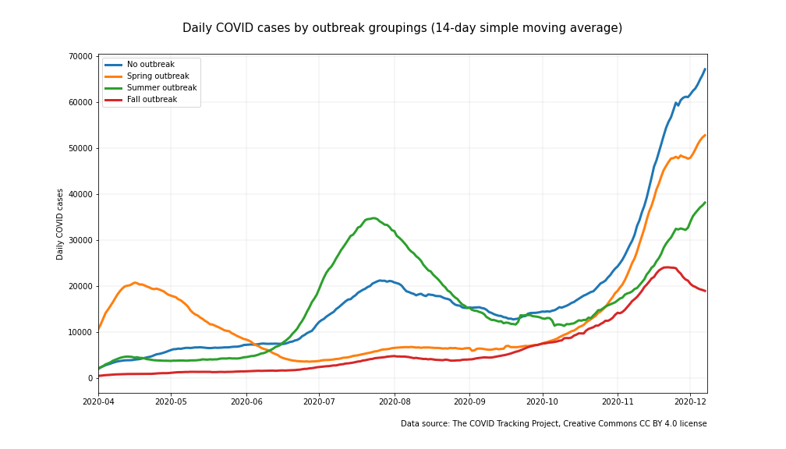
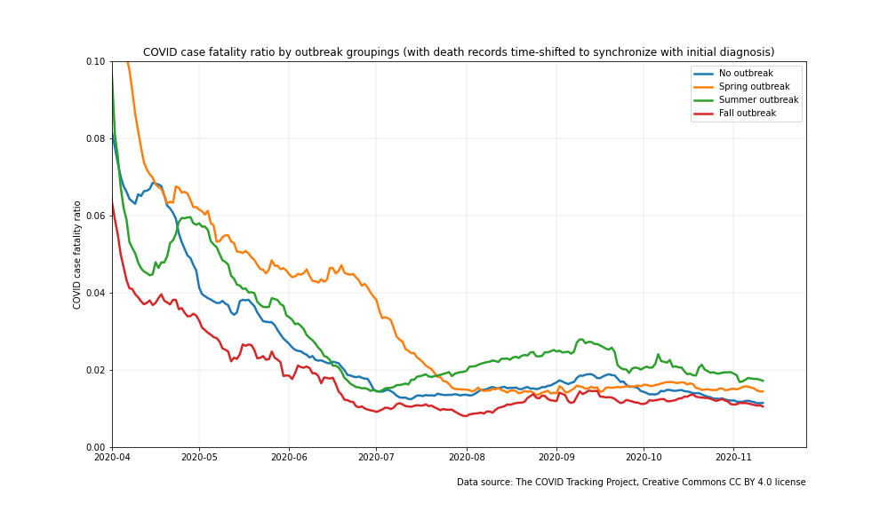

# COVID Early Warning System Project Overview

This project is an attempt to define a good early warning indicator for COVID outbreaks. States and public health agencies have a difficult job to keep COVID transmission under control. One of the keys to control is a system that provides them an early and accurate warning of an increase in new COVIC infections in their jurisdiction. How good is the data that they are currently using at providing that early indiactor? Is there a way to improve upon the timeliness and accuracy of the warning?

## Part 1: COVID Early Warning System Analysis

This project grew out of an interest to compare the available data from states that had experienced an outbreak vs. states that hadn't experienced an outbreak. As the analysis progressed it became clear that the common statistical measures of COVID-19 infection spread that are utilized today--total cases, case rates, and positive test rates--are not all equally informative. One is better than the others, yet all of them have their shortcomings. The first part of this project explores the shortcomings with the measures that are currently available. It identifies the data that most clearly and consistently correlates with outbreaks.

The first part of this project (described in this repo) informs the second part--a proposed alternative regional COVID-19 early warning system. This proposal addresses some of the shortcomings of the currently available tools to provide an earlier and more accurate warning of an increase in new COVID infections. Simulations of this alternative systems are modeled to compare its theoretical improvement in performance over current options. Ideally, a system like this could ultimately allow state governments and public health agencies to react sooner and keep an uptick from turning into an outbreak. This system is described in more detail [here](https://github.com/salvir1/part-2-covid-early-warning-system). 

## Goals

The high level goals of this project are:
- To characterize the difference at the regional level between an uptick and an outbreak in COVID case rates
- To develop statistics that could become the foundation of a COVID-19 earling warning system (described [here](https://github.com/salvir1/part-2-covid-early-warning-system))
- To work with various EDA and data visualization tools and techniques

## Tools and techniques used in this project

**Tools**
- Python, Jupyter Lab, SciKitLearn, Pandas, Numpy

**Visualization**
- Plotly, Matplotlib

**Techniques**
- Time series, spatial mapping, simple moving average, simulation

## Raw data sourced from COVID Tracking Project

- Terms of use: The COVID Tracking Project at The Atlantic’s data and website content is published under a Creative Commons CC BY 4.0 license, which requires users to attribute the source and license type (CC BY 4.0) when sharing our data or website content.
- Citation: [the COVID Tracking Project](https://www.covidtrackingproject.com), Creative Commons CC BY 4.0 license

## State groupings bring important trends to light

As the COVID-19 epidemic unfolded in the US over the course of 2020, outbreaks came in waves. These waves were not uniform across the country. Rather, each of the three distinct identifiable waves had its own unique geographic distribution. Most states, thankfully, only experienced one wave. Many others avoided severe outbreaks altogether. For those that had an outbreak, they were costly in terms of lives lost. By grouping states together according to outbreak--and a fourth group of states that did not experience an outbreak--one can see these outbreaks clearly, and also see just how costly these outbreaks were. ([Click here](#State-groupings) to learn how and why these groups were constructed).

The four charts below illustrate the outbreaks in different ways. The upper left chart shows daily deaths per 100,000 people for the four different groupings. The upper right chart shows daily new case diagnoses per 100,000 for the same groupings. The lower left chart shows the total new diagnoses made per day. Finally, the lower right chart shows the positive test rate per day. A discussion of these charts and related topics follow. ([Click here](#Large-charts) for larger versions of these charts).

 </img>
 </img>

 </img>
 </img>

Another way to display changes over time is with an animation. Click on the links below to see the dynamic progression of the COVID-19 outbreak at the state level over time. (Due to the limitations of the Github repo to run html in markdown language, you may need to copy the html files to a local folder and then open them to see the animation. Links to the files are here. They can be found in the img directory of this repo.)

[death rate animation](https://github.com/salvir1/outbreak-vs-uptick/blob/main/img/death-rate-map.html)

[case rate animation](https://github.com/salvir1/outbreak-vs-uptick/blob/main/img/case-rate-map.html)

[positive test rate animation](https://github.com/salvir1/outbreak-vs-uptick/blob/main/img/positive-rate-map.html)

### Outbreak avoidance saves lives

The chart of death rates shows that states with outbreaks experienced death rates that were many times worse than states with no outbreak over the same time period. The baseline daily death rate stayed below 0.25 per 100,000 if no outbreak was occurring. Death rates were three or more times higher for groupings that were experiencing an outbreak. The cost of an outbreak in terms of lives lost can be extrapolated by comparing the elevated death rate of an outbreak to baseline. For example, the states that experienced a summer outbreak had over 25,000 more deaths above baseline.

### Time is critical to contain an emerging outbreak

The chart of case rates shows a shared baseline among groups that weren't experiencing an outbreak. (Note that although the baseline wasn't uniform and rose a bit over the summer, there was little change in the death rate over that same time period. Much of the increase in case rate might be attributable to the vastly expanded testing availability that occurred during that period and allowed for more cases to be diagnosed). The successive outbreaks emerged quickly and rose steeply. The implicit message in the sharpness of the outbreak curves is that time is critical to contain an emerging outbreak.

The curve becomes even more steep if we look at new active infections, and not just those that were confirmed with a diagnosis. Numerous studies point to many times more people being infected than diagnosed. One recent meta-analysis estimated 3-20 actual infections for every confirmed positive COVID diagnosis ([Wu](https://www.nature.com/articles/s41467-020-18272-4)). 

There are many reasons why cases may go undiagnosed with a positive test. Some people infected with COVID are asymptomatic and do not know to get tested. A recent meta-analysis found that 17% of COVID-19 cases are asymptomatic ([Byambasuren](https://jammi.utpjournals.press/doi/abs/10.3138/jammi-2020-0030)). Many others may develop symptoms but may not get tested. And there's false negatives from testing. 

We can use a conservative estimate of 2.5 infections for every diagnosis to get a picture of just how steep the actual infections curve looks. The green trendlines below show an estimate of new active infections for the states of Montana and Utah superimposed on graphs of diagnosed case rates.

 

### Time is critical: Old news is not good news

The vast majority of positive cases (i.e. the numerator in all COVID monitoring metrics) comes from diagnostic tests of people who are symptomatic. Does reliance on confirmatory diagnostic tests add delay? People who become infected with COVID are thought to be shedding virus on average 2-3 days before they're symptomatic, if they're ever symptomatic ([Harvard](https://www.health.harvard.edu/diseases-and-conditions/if-youve-been-exposed-to-the-coronavirus)). Once symptomatic, they then need to decide to get tested, get tested (probably depends on the severity of the infection--it could range from 1 day to never), and await for the test results to find their way to the tracking system (which can be from 1 to several days). Simply adding up these numbers suggests that a positive test result from a symptomatic person could take 6 or more days from active, detectable infection to when it enters a tracking database. The infection estimates in the previous time series were shifted back 6 days to simulate when the new infections first became detectable. 

There's good reason to believe this number is worse than that.

Is there a test regimen and test process system that could shorten this delay from detectability? Many universities are utilizing surveillance systems where they're going looking for active infections and not waiting until they show up. Further discussion of this approach at the state level can be found [here](https://github.com/salvir1/part-2-covid-early-warning-system).

### Time is critical: Noisy data adds delay

COVID testing regimens have been designed for other reasons than to provide a statistically accurate measure of the changing rate of infection in a population. As such, noise finds its way into the signal. For instance, the COVID test sites in a jurisdiction often test for different reasons. Clinics may be doing pre-procedural testing to confirm the absence of COVID pre-procedure. Positive test rates from these screening procedures will mirror disease prevalence among asymptomatic people with rates of 1-2% or lower. These clinics may perform these tests only a few days a week. Locations run by public health agencies may be testing mostly symptomatic people some days. These diagnostic tests may have positive test rates from these sites on these days may exceed 25% or more. At different days for these same public health agency locations, they may test a high percentage of asymptomatic students from a school or employees from a company, thus reducing the positive test rate significantly.

States report all submitted test reports in a single batch for a day regardless of whether they were screening tests or diagnostic tests. The ratio of screening tests to diagnostic tests can fluctuate significantly from day-to-day. Consequently, the ratio of symptomatic to asymptomatic people in a batched daily test report for a state can--and does--vary tremendously. 

Another layer of noise is introduced when test samples are processed at the labs and reported back. Test sites across a state may utilize different labs. Turnaround times for the various labs are often different. Some labs may batch tests and report several days worth of results at a time, where others report every 24 hours. Not only could this lack of process affect the ratio of symptomatic to asymptomatic people in a batched daily test report, it can have a big impact on the total number of tests reported on in any given day. Taken together, the fluctuating ratios of symptomatic to asymptomatic people in the test pool and the different batching methods contribute to noisiness in the signal from day-to-day. 

The high daily variability is clearly visible in COVID metrics in use today. The positive test rate and case rate charts for the state of Montana are below. Note the day-to-day variability. 'Control limit' horizontal lines have been added to each chart derived from  the mean values for the month of August plus two standard deviations to give a sense of the size of the variance. Once the moving average crosses the control limit line, it suggests an underlying change may have occurred to the mean. I.e. an outbreak may be emerging. For the chart on the right, two vertical lines have been added to indicate when the moving averages of the time series crossed the control limits--i.e. when their signals would have triggered a warning. The simulated warnings occur well after the new active infection rates have begun to rise.

</img>

### A closer look at timing

Governments and public health agencies are unlikely to drive the death rate down to zero until a vaccine is available, but they can work to avoid an outbreak and the associated costs of lives lost. Clearly, timing is important. By the time death rates start to increase, an outbreak has been many weeks in the making. While the death rate may be the most direct measure of the cost of the pandemic, it's a lagging indicator. Governments and public health agencies need an early warning system--a leading indicator or indicators--in order to have the best chance at keeping the rate of infections, and thus deaths, under control in their jurisdictions. 

Many state governments and public health agencies pay close attention to the daily updates of their COVID metrics, but the delays outlined above hinder the ability of their COVID monitoring systems to detect an outbreak in a timely fashion. Here are charts from two states working hard to stay ahead of outbreaks yet experiencing outbreaks nonetheless. Lines have been added to indicate when they notified the public of the recent outbreak and began to take action. Note how much the estimated new infections rate has risen by the time notification occurs. 

 </img>
 </img>

<!-- 

 </img>
 </img>

 -->

### Normalization of the data improves it

Returning to the original four charts, one small but important detail to note is that normalizing the data makes for better comparisons. The chart of *total cases diagnosed per day* isn't as clean of an indicator of an outbreak. Why call this detail out? Because the *total cases diagnosed per day* number is very frequently mentioned in the press, but it has potential to be misleading. (Total cases diagnosed per day is often *the first* statistic cited by the press, regardless of how much the availability of testing has changed and continues to change.)

In this graph, the trendline of total cases diagnosed in the *no outbreak* group rose almost as much as the trendline for the *summer outbreak* group. Yet the *death rate*, which is the measure that matters the most, did not increase correspondingly in the *no outbreak* group. All trendlines rose heading into the fall even though the outbreak (death rate) for the *fall outbreak* group has thus far been more severe. The normalization that occurs in the *case rate* chart more accurately sorts out the true signal. 

### We learned from the traumatic events of the spring how to reduce adverse outcomes

It's informative to compare the peaks in the trendlines between the *death rate* and the *case rate* charts. As one would expect, the peaks of the case rate trendlines happen earlier than the peaks of the death rate trendlines. What is less expected is the differences in their relative sizes. Fortunately, the peak of the summer outbreak death rate was less than half the size as that of the spring outbreak. A likely explanation for some of the difference in death rates is that the medical community learned how to take better care of COVID patients over time. It's also likely that people who were most at risk to adverse outcomes from COVID were infected at lower rates in those places that experienced a summer outbreak than they were in locations that experienced a spring outbreak. It could be that we learned how to take better care of COVID patients and also improved our ability to keep the most vulnerable of us from getting infected with COVID in the first place.

It's also worthwhile noting that the corresponding case rate peak was almost twice as large for the summer outbreak as it was for the spring outbreak. This is clearly due to testing availability.

### Should we be looking more keenly at infection rates of COVID in people with high contact rates?

It's also informative to compare the height of the peaks of the death rate and case rate for the summer outbreak (and also for the fall outbreak although that story has not yet fully played out). The change in testing availability muddies things up a bit, but visually it appears as if the change in height of the case rate surpasses the change in height of the death rate. In other words, infection rates may have expanded more than death rates. 

This is plausible when one considers that neither transmission rates nor risk of adverse outcomes are uniform across a population. Taking the transmission rates first, transmission occurs through proximite human-to-human contact. One would expect people with higher contact rates to have higher rates of infection. *Indeed, one would expect the spread of COVID virus to be dependent upon those of us with higher contact rates.* Now, taking adverse outcomes into account, certain subsets of the population have much higher risk of death than others. Seventy-nine percent of COVID deaths in the US occurred in [people older than 65](https://www.cdc.gov/nchs/nvss/vsrr/covid_weekly/index.htm). Continued emphasis must be on reducing transmission to this population. This knowledge could be used as the foundation for a targeted COVID surveillance system. We could monitor COVID infection rates among the most mobile of us where an outbreak will start to form first as one key element in a strategy to minimize transmission to the most vulnerable of us.

### State groupings

How were these groupings made? A retrospective analysis of daily COVID case and death by state for the US was conducted for data from 3/10/20 to 10/15/20. Over this time, three distinctly timed outbreaks swept through different parts of the country. States were grouped into one of these three outbreak categories or a fourth *no outbreak* category if they did not experience an outbreak during this time.

Outbreaks for the spring, summer, and fall began prior to 4/15/20, 7/15/20, and 10/15/20 respectively. Since testing availability was limited in the spring and increasing during the summer, death rates were used to identify the spring and summer outbreak periods. Deaths trail infections by several weeks, so states with spring outbreaks typicaly saw deaths peak in mid May and states with summer outbreaks typically saw deaths peak in August. A state was classified to one of these two outbreak groupings if the reported daily death rate from COVID for the state consistently exceeded 0.4 per 100,000 population for that time period.

Testing availability had become more available by mid summer, and case rate comparability became a more useful measure. All states with a death rate exceeding 0.4 per 100,000 during the summer outbreak also had a daily new diagnoses case rate consistently above 30 cases per 100,000. Only Tennessee briefly exceeded 30 cases per 100,000 over the summer without having an outbreak with a corresponding death rate in excess of 0.4 per 100,000. Almost all other states saw case rates below 25 per 100,000. 

This analysis is being conducted concurrent to the fall outbreak with a cutoff of 10/15/20. Since the impact on death rate is not yet fully visible on the data, the fall outbreak group was identified stricly by the case rate. The fall outbreak group was identified by case rate above 30 prior to 10/15/20. Unfortunately but predictably, death rates for this group of states is now rising from baseline. 

Since 10/15/20, a fourth outbreak category appears to be forming quickly on the heels of the fall outbreak. It doesn't look like the country will experience an ebb in infections like it did after the spring or summer outbreaks. 

Spring outbreak
- Infections occurred prior to 4/15/20
- Deaths consistently exceeded 0.5 per 100,000 per day in May and June
- Occurred primarily in the northeast, Great Lakes region, and Louisiana
- About 90M people are in this group

Summer outbreak
- Infections occurred 4/15/20 - 7/15/20
- Deaths consistently exceeded 0.4 per 100,000 per day in late July through early September
- Cases consistently exceeded 30 per 100,000 per day
- Occurred primarily in the southeast and Arizona
- About 89M people are in this group

Fall outbreak
- Infections occurred 7/15/20 - 10/15/20
- Too early to tell when death rates will peak and how high, but rates for this group are already higher than other states
- Cases consistently exceeded 30 per 100,000 per day
- Upper midwest, some Rocky Mountain states, and Arkansas
- About 19M are in this group

No outbreak
- Avoided classification in one of the other outbreak categories
- About 130M people are in this group

The state groupings help to sort the state trends in a meaningful way. One can see this by attempting to look at the death rate trendline at the state level for just 25 states. The chart below of daily COVID death rates by state over time is a confusion of squiggly lines, although one can start to see patterns if one looks long enough. 

</img>

The state level trendlines become more understandable when states are presented in the same groupings as before. The following charts display the COVID statistics of death rate, case, rate, and positive test rate, but now at the state level.

The state-level charts reveal the dangerous acceleration of a COVID outbreak more clearly. Note the steep upward trajectory of deaths and case rates for a number of states that experienced an outbreak. This underscores the importance of time in identifying an emerging outbreak. Once an outbreak begins it can grow quickly and leave state governments and public health agencies scrambling to try to get ahead of a steep curve.  

</img>

</img>

</img>

### A case rate threshhold?

The [State groupings](#State-groupings) section identified a key threshhold between states that didn't experience an outbreak over a time period and those that did. Once testing was no longer rationed like it was in the early months of the epidemic, states that experienced outbreaks had case rates above 30 per 100,000. Only one state, Tennessee, briefly had a case rate above 30 without a corresponding death rate above 0.40 deaths per 100,000. 

Although it's hard to compare case rates between states given that the sources of data that go into the case rate aren't controlled properly to make accurate statistical comparisons, a single number that has thus far told the story across nearly every state suggests that there *is* an underlying real threshhold, and 30 cases per 100,000 per day is a reasonable approximation for it given the data limitations. 

### Large charts

</img>

</img>

</img>

</img>

[Click to return to narrative section](#State-groupings-bring-important-trends-to-light)

### SIDEBAR: Case fatality ratio

</img>

Note that the reported death time series was shifted forward by 14 days to synchronize up better with the case time series so that an accurate case fatality ratio could be calculated.
What are the takeaways from this chart?

- The case fatality ratio has been reduced significantly from the early days of the pandemic. This can probably be attributed to several factors. For one, much more testing is being done, so fewer cases are being missed. For two, the medical community knows much more about how to care for patients with the disease, which has probably led to better outcomes. 
- The case fatality ratio crept up a bit for the summer outbreak group, but otherwise hasn't seen marked changes after spring ended. There's no strong indication that summer's crowded hospitals had a major impact on case fatality--at least in this slice of the data.

## Areas for further study

- This analysis informed the development and simulation of an early warning system based on randomized sampling of a subset of a population of people for pre-symptomatic COVID infection. This proposed early warning system is described in more detail [here](https://github.com/salvir1/part-2-covid-early-warning-system). 
- Another further area of study would be to extend this analysis to other geographic regions outside of the US such as Europe.

## Contributors
[Rob Salvino](https://github.com/salvir1)

## License
[MIT ©](https://choosealicense.com/licenses/mit/)
