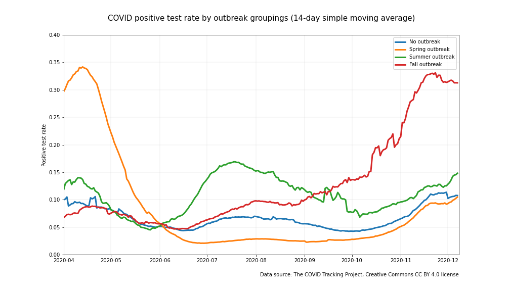
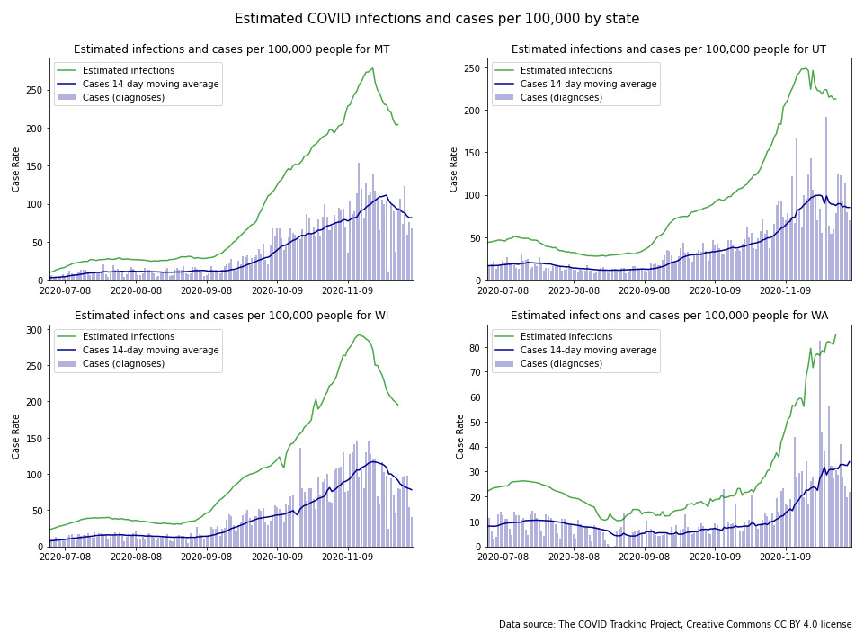
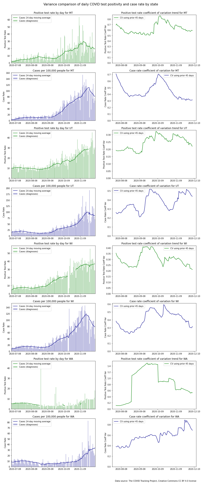
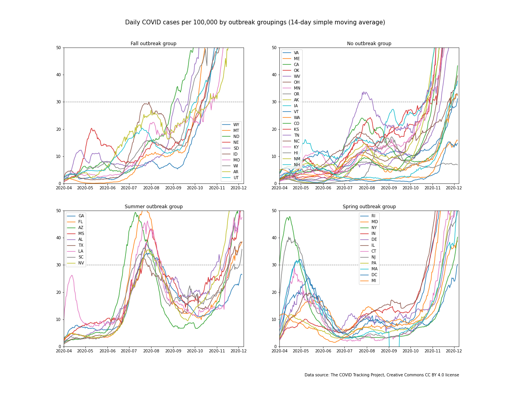

# COVID Early Warning System Project Overview

This project is an attempt to define a good early warning indicator for COVID outbreaks. States and public health agencies have a difficult job to keep COVID transmission under control while simultaneously managing their economies and battling pandemic fatigure. One of the keys to controlling infections is a system that provides governments with an early and accurate warning of an increase in new COVIC infections in their jurisdiction. How good is the data that they are currently using at providing that early indiactor? Is there a way to improve upon the timeliness and accuracy of the warning?

This project grew out of an interest to compare the available data from states that had experienced an outbreak vs. states that hadn't experienced an outbreak. As the analysis progressed it became clear that the common statistical measures of COVID-19 infection spread that are utilized today--total cases, case rates, and positive test rates--all have their shortcomings. The essential problem is that the data feeding into these measures comes from two distinct populations--people who are symptomatic and those who are asymptomatic. These two populations have different rates of infection. Tests from both populations are combined in a haphazard fashion making statistical comparisons from one day to the next or one state to the next problematic. The data source issues don't impact all measures equally. The study identifies case rate as the one metric that most clearly and consistently correlates with outbreaks-albeit not as quickly or definitively as desired. The analysis portion of this project is summarized in this document.

The data analysis informs a proposed alternative regional COVID-19 early warning system. This proposal [described in detail here](https://github.com/salvir1/COVID-19-early-warning-system) addresses some of the shortcomings of the currently available tools to provide an earlier and more certain warning of an increase in new COVID infections. Simulations of these alternative concepts are modeled to compare its theoretical improvement in performance over current options. Ideally, a system like this could ultimately allow state governments and public health agencies a more timely picture of COVID prevalence in their jurisdictions so that they know when they need to respond to keep an uptick from turning into an outbreak. 

## Goals

The high level goals of this project are:
- To propose a statistically sound COVID-19 earling warning system
- To characterize the data signals that correspond to the various COVID outbreaks that have occurred in the US
- To work with various EDA and data visualization tools and techniques

## Tools and techniques used in this project

**Tools**
- Python, Jupyter Lab, SciKitLearn, Pandas, Numpy

**Visualization**
- Plotly, Matplotlib

**Techniques**
- Time series, clustering, spatial mapping, simple moving average, linear regression, simulation

## Raw data sourced from COVID Tracking Project

- Terms of use: The COVID Tracking Project at The Atlantic’s data and website content is published under a Creative Commons CC BY 4.0 license, which requires users to attribute the source and license type (CC BY 4.0) when sharing our data or website content.
- Citation: [the COVID Tracking Project](https://www.covidtrackingproject.com), Creative Commons CC BY 4.0 license# SECTION 1: State groupings bring important trends to light

# SECTION 1: State groupings bring important trends to light

As the COVID-19 epidemic unfolded in the US over the course of 2020, outbreaks came in waves. These waves were not uniform across the country. Rather, each of the three distinct identifiable waves had its own unique geographic distribution. Most states, thankfully, only experienced one wave. Many others avoided severe outbreaks altogether. For those that had an outbreak, they were costly in terms of lives lost. By grouping states together according to outbreak--and a fourth group of states that did not experience an outbreak--one can see these outbreaks clearly, and also see just how costly these outbreaks were. ([Click here](#SECTION-4-State-groupings) to learn how and why these groups were constructed).

The four charts below illustrate the outbreaks in different ways. The upper left chart shows daily deaths per 100,000 people for the four different groupings. The upper right chart shows daily new case diagnoses per 100,000 for the same groupings. The lower left chart shows the total new diagnoses made per day. Finally, the lower right chart shows the positive test rate per day. A discussion of these charts and related topics follow. ([Click here](#SECTION-5-Large-charts) for larger versions of these charts).

 </img>
 </img>

 </img>
 </img>

Another way to display changes over time is with an animation. Click on the links below to see the dynamic progression of the COVID-19 outbreak at the state level over time. (Due to the limitations of the Github repo to run html in markdown language, you may need to copy the html files to a local folder and then open them to see the animation. Links to the files are here. They can be found in the img directory of this repo.)

[death rate animation](https://github.com/salvir1/outbreak-vs-uptick/blob/main/img/death-rate-map.html)

[case rate animation](https://github.com/salvir1/outbreak-vs-uptick/blob/main/img/case-rate-map.html)

[positive test rate animation](https://github.com/salvir1/outbreak-vs-uptick/blob/main/img/positive-rate-map.html)

## Outbreak avoidance saves lives

The chart of death rates shows that states with outbreaks experienced death rates that were many times worse than states with no outbreak over the same time period. The baseline daily death rate stayed below 0.25 per 100,000 if no outbreak was occurring. Death rates were three or more times higher for groupings that were experiencing an outbreak. The cost of an outbreak in terms of lives lost can be extrapolated by comparing the elevated death rate of an outbreak to baseline. For example, the states that experienced a summer outbreak had over 25,000 more deaths above baseline.

Governments and public health agencies are unlikely to drive the death rate down to zero until a vaccine is available, but they can work to avoid an outbreak and the associated costs of lives lost. Clearly, timing is important. By the time death rates start to increase, an outbreak has been many weeks in the making. While the death rate may be the most direct measure of the cost of the pandemic, it's a lagging indicator. Governments and public health agencies need an early warning system--a leading indicator or indicators--in order to have the best chance at keeping the rate of infections, and thus deaths, under control in their jurisdictions.

## Normalization of the data improves it

One small but important detail to note is that normalizing the data makes for better comparisons. The chart of total cases diagnosed per day isn't as clean of an indicator of an outbreak as death rate or case rate. Why call this detail out? Because the total cases diagnosed per day number is very frequently mentioned in the press, but it has potential to be misleading. Total cases diagnosed per day is often the first statistic cited by the press, regardless of how much the availability of testing has changed and continues to change.

Failing to normalize data can cause small changes in large states to swamp large changes in small states. This can be seen quite clearly in the summertime data when a large outbreak hit mostly small states. In total cases diagnosed per day graph, the trendline of total cases diagnosed in the no outbreak group rose almost as much as the trendline for the summer outbreak group. Yet the death rate--the measure that matters the most--did not increase correspondingly in the no outbreak group. The case rate charts show the summer outbreak nicely aligned with the death rate charts.

State-to-state comparisons can be quite useful. Without a coordinated national response, the country is essentially running 50 separate experiments on how to respond to an epidemic. State-to-state comparisons can suggest answers to important questions like, "Is there a infection rate threshold that avoids outbreaks?" One has to normalize data first to begin to compare data to answer this and other questions. 

## We learned from the traumatic events of the spring how to reduce adverse outcomes

It's informative to compare the peaks in the trendlines between the *death rate* and the *case rate* charts. As one would expect, the peaks of the case rate trendlines happen earlier than the peaks of the death rate trendlines. What is less expected is the differences in their relative sizes. Fortunately, the peak of the summer outbreak death rate was less than half the size as that of the spring outbreak. A likely explanation for some of the difference in death rates is that the medical community learned how to take better care of COVID patients over time. It's also likely that people who were most at risk to adverse outcomes from COVID were infected at lower rates in those places that experienced a summer outbreak than they were in locations that experienced a spring outbreak. It could be that we learned how to take better care of COVID patients and also improved our ability to keep the most vulnerable of us from getting infected with COVID in the first place.

It's also worthwhile noting that the corresponding case rate peak was almost twice as large for the summer outbreak as it was for the spring outbreak. This is clearly due to testing availability.

## Time is critical to contain an emerging outbreak

The chart of case rates shows a shared baseline among groups that weren't experiencing an outbreak. The successive outbreaks emerged quickly and rose steeply. The steepness in the slope of the outbreak curves implies that time is critical to contain an emerging outbreak. (Note that although the baseline wasn't uniform and rose a bit over the summer, there was little change in the death rate over that same time period. Much of the increase in case rate might be attributable to the vastly expanded testing availability that occurred during that period and allowed for more cases to be diagnosed). 

# SECTION 2: Time is critical

## When an outbreak occurs, new active infections increase faster than what the data shows

The *infections* curve becomes even more steep if we look at new active infections, and not just those that were confirmed with a diagnosis. Numerous studies point to substantially more people being infected than diagnosed ([Shuchi](https://www.thelancet.com/journals/lancet/article/PIIS0140-6736(20)32009-2/fulltext), [Hicks](https://academic.oup.com/jid/advance-article/doi/10.1093/infdis/jiaa623/5917625), [Gudbjartsson](https://www.nejm.org/doi/full/10.1056/NEJMoa2026116)). The CDC has been conducting seroprevalence surveys (prevalence of antibodies to COVID in blood samples) in people across the country. They provide estimates on their website of the total people who have been infected  compared to the actual number of diagnoses. For states in the northeast with early outbreaks, estimates are around 10 actual cases based on antibody testing for every 1 diagnosed case. For other states with outbreaks that occurred later when testing was more widely avaiable, the numbers are generally around 3-4 actual cases per actual diagnosis ([CDC](https://covid.cdc.gov/covid-data-tracker/#national-lab)).

We can use a conservative estimate of 2.5 infections for every diagnosis to get a picture of just how steep the actual infections curve looks (2.5 times steeper to be precise). The green trendlines below show estimates of new active infections for several states superimposed on graphs of diagnosed case rates.

## Old news is not good news

The vast majority of positive cases (i.e. the numerator in all COVID monitoring metrics) comes from diagnostic tests of people who are symptomatic. Does reliance on confirmatory diagnostic tests add delay? People who become infected with COVID are thought to be shedding virus on average 2-3 days before they're symptomatic, if they're ever symptomatic ([Harvard](https://www.health.harvard.edu/diseases-and-conditions/if-youve-been-exposed-to-the-coronavirus)). Once symptomatic, they then need to decide to get tested, get tested (probably depends on the severity of the infection--it could range from 1 day to never), and await for the test results to find their way to the tracking system (which can be from 1 to several days). Simply adding up these numbers suggests that a positive test result from a symptomatic person could take 6 or more days from active, detectable infection to when it enters a tracking database. The infection estimates in the previous time series were shifted back 6 days to simulate when the new infections first became detectable.

Is there a test regimen and test process system that could shorten this delay from detectability? A early warning surveillance system is proposed in the second half of this project which can be found [here](https://github.com/salvir1/part-2-covid-early-warning-system).

## Haphazardly mixing two very different test populations into one dataset adds uncertainty

CCOVID testing regimens have been designed for other reasons than to provide a statistically accurate measure of the changing rate of infection in a population. For example, clinics may do pre-procedural testing to confirm the absence of COVID. Positive test rates from these screening procedures will mirror disease prevalence among asymptomatic people with rates of 1-2% or lower. These clinics may perform these tests only a few days a week. On the other hand, locations run by public health agencies may be testing mostly symptomatic people. These diagnostic tests may have positive test rates from these sites on these days may exceed 25% or more. States report all submitted test reports in a single batch for a day regardless of whether they were screening tests or diagnostic tests. The ratio of screening tests to diagnostic tests can fluctuate significantly from day-to-day. Consequently, the ratio of symptomatic to asymptomatic people in a batched daily test report for a state can--and does--vary tremendously. 

Another layer of noise is introduced when test samples are processed at the labs and reported back. Test sites across a state may utilize different labs. Turnaround times for the various labs are often different. Some labs may batch tests and report several days worth of results at a time, where others report every 24 hours. Not only could this lack of process affect the ratio of symptomatic to asymptomatic people in a batched daily test report, it can have a big impact on the total number of tests reported on in any given day. Taken together, the fluctuating ratios of symptomatic to asymptomatic people in the test pool *with their different mean rates* and the different batching methods contribute to noisiness in the signal from day-to-day. The uncontrolled mixing of two distinct test populations--diagnostic and screening--into one dataset makes it hard to see from the data what is actually going on with infection rates in the community. 

The mixing of these two populations compromises statistical comparisons along the time series. In other words, the data violates the stationarity and homoscedasticity principles. The positive test rate and case rate charts for several states are below on the left. Note how the day-to-day variability over the summer for charts on the left becomes larger during the fall. Some of this is due to a changing mean. This isn't the full story though. The charts on the right show trendlines of the coefficients of variation for the data in the charts on the left. (The coefficient of variation is the standard deviation normalized to the mean. The higher the coefficient of variation, the more variable the data with respect to the mean.) The trendlines were constructed by computing the coefficient of variation for a given day from the prior 45 days worth of data. The coefficient of variation would be relatively constant if the variation was stationary with respect to the mean. The trendline charts show that it isn't. The large and wandering coefficients of variation make it hard to draw inferences from new data as it comes in. If a new datapoint appears to be different than previous points, has the underlying mean of the process changed or has the variation changed? All of the coefficient of variation trendlines are large and wandering, but the positive test rate trendlines are generally worse. 

Here's another way to see the lack of stationarity in the variation. The following charts show the *case rate* time series for the state of Washington (through mid November 2020) deconstructed into trend, seasonal, and residual components. The residual components would look randomly distributed if the data adhered to stationarity principles, but they clearly don't.

## A final look at timing

State governments and public health agencies pay close attention to the daily updates of their COVID metrics, but the delays and noisiness of the data outlined above may hinder the ability of their COVID monitoring systems to detect an outbreak in a timely manner with certainty. This is all the more challenging since state governments are also trying to minimize the impact of the coronavirus and coronavirus restrictions on their economies. It's a difficult balancing act.

Here are *case rate* charts from several states where their government leaders and health officials are working hard to strike the right balance. These graphs have all been scaled to have the same y-axis scale. Lines have been added to indicate when they notified the public of what they viewed to be a concerning rise in cases this fall. Several observations can be drawn from these charts.

Three of the charts show case rates for states with clear outbreaks. Based upon the estimated infections trendlines, new infections may have been on the rise for many days before state governments officially recognized them. New infections continued to rise unabated after the governors and health leadership in these states alerted the public about the emerging outbreaks. These observations hint at potential shortcomings in today's COVID early warning systems. One is that the systems may not be not detecting emerging outbreaks as quickly as they could. Another is that the noisiness of the data may be making hard political decisions even harder. Without a clear, decisive signal, governments may end up playing a wait and see game until things are cleary worse--but also much harder to control. 

The governor of Washington state took a very different path than his counterparts. He issued an outbreak warning to the public with the state experiencing around 10 cases per 100,000 per day. He followed this up several weeks later with bans on indoor gathering and dining as the case rate approached 18 cases per 100,000 and as outbreaks reached neighboring states. This was a difficult decision with serious consequences for the thousands of restaurants and other businesses in the state. Clearly, good data is essential to good decision-making. With regards to the widely followed *case rate* measure, the coefficient of variation of the case rate was not stable for Washington state. It had nearly doubled since the summer time. This muddied the picture for this one very important statistic at a critical time. Was the mean actually changing or was it that it was the measure simply becoming more variable?

The divergence of approaches between states is not surprising in light of the vacuum of federal leadership during this pandemic. It is unfortunate that at this stage in the pandemic we don't have a commonly-accepted set of best practices that best balances the impact on peoples' lives and livelihoods. With so much at stake and with a dearth of federal leadership, good data that provides a clear and certain data picture is all the more important. 

</img>

# SECTION 3: Case rate threshhold analysis

The four charts in the previous section all share a common characteristic. During the month of August case rates stayed below 20 cases per 100,000 and no state experienced an outbreak. This held true for other states as well. The [State groupings](#SECTION-4-State-groupings) section identified a key threshhold between states that didn't experience an outbreak over a time period and those that did. Once testing was no longer rationed like it was in the early months of the epidemic, states that experienced outbreaks had **peak** case rates above 30 per 100,000. Only one state, Tennessee, briefly had a peak case rate above 30 without a corresponding death rate above 0.40 deaths per 100,000. 

Although it's hard to compare case rates between states given that the sources of data that go into the case rate aren't controlled properly to make accurate statistical comparisons, a single number that has thus far told the story across nearly every state suggests that there *is* an underlying real threshhold, and a **peak** of 30 cases per 100,000 per day is a reasonable approximation for it given the data limitations. This would relate directly to **R0**, the basic reproduction number that determines how fast an infectious disease is reproducing. 

Here's another approach that arrives at a case rate threshhold--this time looking at **average** case rate over the summer instead of peak case rate. For this analysis, a [*k-means clustering algorithm*](https://en.wikipedia.org/wiki/K-means_clustering) was used to identify the summer outbreak states to minimize subjective bias. The following graph plots average case rates and average death rates by state for the summer months. There is clear separation between the outbreak states in yellow and the no outbreak states in blue. All but one of the *no outbreak* states had **average** case rates below 20 per 100,000. 

</img>

A comparison of the respective means shows a clear difference between the *no outbreak* states and the *outbreak* states over the summertime.

| Classification | Mean Case Rate | Mean Death Rate |
| -------------- | -------------- | --------------- |
| No outbreak    |      9.3       |      0.14       |
| Outbreak       |     24.2       |      0.49       |

# SECTION 4: State groupings

How were these groupings made? A retrospective analysis of daily COVID case and death by state for the US was conducted for data from 3/10/20 to 10/15/20. Over this time, three distinctly timed outbreaks swept through different parts of the country. States were grouped into one of these three outbreak categories or a fourth *no outbreak* category if they did not experience an outbreak during this time.

Outbreaks for the spring, summer, and fall began prior to 4/15/20, 7/15/20, and 10/15/20 respectively. Since testing availability was limited in the spring and increasing during the summer, death rates were used to identify the spring and summer outbreak periods. Deaths trail infections by several weeks, so states with spring outbreaks typicaly saw deaths peak in mid May and states with summer outbreaks typically saw deaths peak in August. A state was classified to one of these two outbreak groupings if the reported daily death rate from COVID for the state consistently exceeded 0.4 per 100,000 population for that time period.

Testing availability had become more available by mid summer, and case rate comparability became a more useful measure. All states with a death rate exceeding 0.4 per 100,000 during the summer outbreak also had a daily new diagnoses case rate consistently above 30 cases per 100,000. Only Tennessee briefly exceeded 30 cases per 100,000 over the summer without having an outbreak with a corresponding death rate in excess of 0.4 per 100,000. Almost all other states saw case rates below 25 per 100,000. 

This analysis is being conducted concurrent to the fall outbreak with a cutoff of 10/15/20. Since the impact on death rate is not yet fully visible on the data, the fall outbreak group was identified stricly by the case rate. The fall outbreak group was identified by case rate above 30 prior to 10/15/20. Unfortunately but predictably, death rates for this group of states is now rising from baseline. 

Since 10/15/20, a fourth outbreak category appears to be forming quickly on the heels of the fall outbreak. It doesn't look like the country will experience an ebb in infections like it did after the spring or summer outbreaks. 

Spring outbreak
- Infections occurred prior to 4/15/20
- Deaths consistently exceeded 0.5 per 100,000 per day in May and June
- Occurred primarily in the northeast, Great Lakes region, and Louisiana
- About 90M people are in this group

Summer outbreak
- Infections occurred 4/15/20 - 7/15/20
- Deaths consistently exceeded 0.4 per 100,000 per day in late July through early September
- Cases consistently exceeded 30 per 100,000 per day
- Occurred primarily in the southeast and Arizona
- About 89M people are in this group

Fall outbreak
- Infections occurred 7/15/20 - 10/15/20
- Too early to tell when death rates will peak and how high, but rates for this group are already higher than other states
- Cases consistently exceeded 30 per 100,000 per day
- Upper midwest, some Rocky Mountain states, and Arkansas
- About 19M are in this group

No outbreak
- Avoided classification in one of the other outbreak categories
- About 130M people are in this group

The state groupings help to sort the state trends in a meaningful way. One can see this by attempting to look at the death rate trendline at the state level for just 25 states. The chart below of daily COVID death rates by state over time is a confusion of squiggly lines, although one can start to see patterns if one looks long enough. 

</img>

The state level trendlines become more understandable when states are presented in the same groupings as before. The following charts display the COVID statistics of death rate, case, rate, and positive test rate, but now at the state level.

The state-level charts reveal the dangerous acceleration of a COVID outbreak more clearly. Note the steep upward trajectory of deaths and case rates for a number of states that experienced an outbreak. This underscores the importance of time in identifying an emerging outbreak. Once an outbreak begins it can grow quickly and leave state governments and public health agencies scrambling to try to get ahead of a steep curve.  

</img>

</img>

</img>

[Click to return to narrative section](#SECTION-1-State-groupings-bring-important-trends-to-light)

# SECTION 5: Large charts

</img>

</img>

</img>

</img>

[Click to return to narrative section](#SECTION-1-State-groupings-bring-important-trends-to-light)

### SIDEBAR: Case fatality ratio

</img>

Note that the reported death time series was shifted forward by 14 days to synchronize up better with the case time series so that an accurate case fatality ratio could be calculated.
What are the takeaways from this chart?

- The case fatality ratio has been reduced significantly from the early days of the pandemic. This can probably be attributed to several factors. For one, much more testing is being done, so fewer cases are being missed. For two, the medical community knows much more about how to care for patients with the disease, which has probably led to better outcomes. 
- The case fatality ratio crept up a bit for the summer outbreak group, but otherwise hasn't seen marked changes after spring ended. There's no strong indication that summer's crowded hospitals had a major impact on case fatality--at least in this slice of the data.

[Click to return to narrative section](#SECTION-1-State-groupings-bring-important-trends-to-light)

## Areas for further study

- This analysis informed the development and simulation of an early warning system based on randomized sampling of a subset of a population of people for pre-symptomatic COVID infection. This proposed early warning system is described in more detail [here](https://github.com/salvir1/COVID-19-early-warning-system). 
- Another further area of study would be to extend this analysis to other geographic regions outside of the US such as Europe.

## Contributors
[Rob Salvino](https://github.com/salvir1)

## License
[MIT ©](https://choosealicense.com/licenses/mit/)
